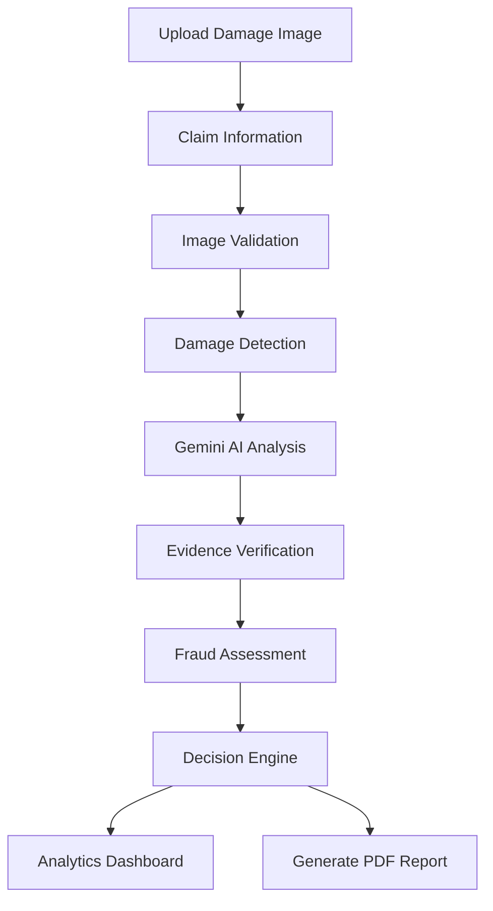

# 🚀 ClaimVision AI


<div align="center" <div align="center">

>

# 🛡️ AI-Powered Damage Claim Verification System

**Intelligent Insurance Evidence Review using Computer Vision & Google Gemini AI**

Analyze damage images, verify claim evidence, assess fraud risk, generate explainable AI insights, and create professional claim reports—all from a single platform.


### 🌐 Live Demo

**https://claimvision-ai-vq2afjukbbvckxmkbuhdil.streamlit.app/**

⭐ **If you like this project, don't forget to Star the repository!**

</div>

---

# 📖 Overview

ClaimVision AI is an AI-powered damage claim verification platform designed to streamline insurance claim review through Computer Vision and Large Language Models.

Instead of manually inspecting every claim, reviewers can upload damage evidence and receive AI-assisted insights, including:

* Damage detection
* Image quality validation
* Evidence consistency analysis
* Fraud risk assessment
* Explainable AI reasoning
* Professional PDF reports

Unlike systems limited to vehicle insurance, ClaimVision AI is built as a **general-purpose damage verification platform** capable of analyzing multiple categories of insurance claims.

---

# 🎯 Supported Claim Types

| Category            | Examples                                       |
| ------------------- | ---------------------------------------------- |
| 📦 Package Damage   | Torn boxes, crushed parcels, damaged packaging |
| 💻 Electronics      | Laptop, monitor, TV, tablet, keyboard          |
| 📱 Mobile Devices   | Smartphones, accessories                       |
| 🚗 Vehicle Damage   | Cars, bikes, scooters, trucks                  |
| 🏠 Property Damage  | Walls, roofs, windows, buildings               |
| 🪑 Household Items  | Furniture, appliances, glass items             |
| 🚚 Logistics Claims | Courier and shipping damages                   |

---

# ✨ Features

## 📷 Evidence Review

* Upload claim images
* Multiple claim categories
* Image preview
* Evidence validation
* Claim description
* Real-time AI processing

---

## 🤖 AI Damage Analysis

* Damage detection
* Severity estimation
* Object recognition
* Image quality assessment
* AI-generated reasoning
* Confidence scoring

---

## 🛡️ Fraud Risk Assessment

* Evidence consistency validation
* Historical claim verification
* Risk categorization
* Suspicious claim detection
* Manual review recommendations

---

## 📊 Analytics Dashboard

* Total claims
* Approval trends
* Rejection statistics
* Severity distribution
* Interactive charts
* Business insights

---

## 📄 Automated PDF Reports

Generate professional reports containing:

* Claim summary
* Uploaded evidence
* AI findings
* Fraud assessment
* Confidence score
* Final recommendation

---

## 🔍 Explainable AI

Every decision includes:

* AI reasoning
* Confidence score
* Evidence explanation
* Decision transparency
* Recommended next steps

---


# 🏗️ System Architecture

```text
                User Uploads Image
                        │
                        ▼
              Streamlit Application
                        │
                        ▼
            Claim Information Input
                        │
                        ▼
            Image Quality Validation
                        │
                        ▼
           Computer Vision (OpenCV)
                        │
                        ▼
             Google Gemini AI
                        │
                        ▼
          Evidence Verification
                        │
                        ▼
          Fraud Risk Assessment
                        │
                        ▼
            Decision Engine
                 │          │
                 ▼          ▼
      Analytics Dashboard   PDF Report
```

---

## AI Analysis Pipeline

The AI analysis workflow has been refactored into a modular plugin architecture.

Pipeline

AnalysisPipeline
├── ImageQualityAnalyzer
├── DamageDetector
├── FraudDetector
└── SeverityEstimator

New analyzers can be added by implementing the Analyzer interface and registering them in AnalysisPipeline.

# 🔄 Application Workflow



---

# 📂 Project Structure

```text
ClaimVision-AI/
│
├── app.py
├── main.py
├── report_generator.py
├── requirements.txt
├── README.md
│
├── src/
│   ├── claim_extractor.py
│   ├── image_analyzer.py
│   ├── evidence_checker.py
│   ├── history_checker.py
│   └── decision_engine.py
│
├── models/
├── notebooks/
├── evaluation/
├── reports/
├── utils/
└── assets/
```

---

# 📦 Module Overview

| Module              | Responsibility                     |
| ------------------- | ---------------------------------- |
| app.py              | Streamlit interface                |
| claim_extractor.py  | Collects and structures claim data |
| image_analyzer.py   | Damage detection using OpenCV      |
| evidence_checker.py | Validates uploaded evidence        |
| history_checker.py  | Performs fraud-related checks      |
| decision_engine.py  | Generates final recommendation     |
| report_generator.py | Creates downloadable PDF reports   |

---

# 🛠️ Tech Stack

| Layer            | Technologies         |
| ---------------- | -------------------- |
| Frontend         | Streamlit, HTML, CSS |
| Backend          | Python               |
| AI               | Google Gemini AI     |
| Computer Vision  | OpenCV               |
| Machine Learning | Scikit-Learn         |
| Data Processing  | Pandas, NumPy        |
| Visualization    | Plotly               |
| Reporting        | ReportLab            |

---

# 🚀 Getting Started

## Clone Repository

```bash
git clone https://github.com/Komal2008/ClaimVision-AI.git

cd ClaimVision-AI
```

## Create Virtual Environment

### Windows

```bash
python -m venv venv
venv\Scripts\activate
```

### Linux / macOS

```bash
python3 -m venv venv
source venv/bin/activate
```

## Install Dependencies

```bash
pip install -r requirements.txt
```

## Configure Environment

Create a `.env` file:

```env
GEMINI_API_KEY=YOUR_API_KEY
```

## Run the Application

```bash
streamlit run app.py
```

---

# 📊 End-to-End Workflow

| Step | Description             |
| ---- | ----------------------- |
| 1    | Upload damage image     |
| 2    | Select claim category   |
| 3    | Enter claim details     |
| 4    | AI analyzes evidence    |
| 5    | Validate evidence       |
| 6    | Assess fraud risk       |
| 7    | Generate recommendation |
| 8    | View dashboard          |
| 9    | Export PDF report       |

---

# 🧪 Roadmap

* [X] Multi-image verification
* [X] OCR for claim documents
* [ ] Video damage analysis
* [ ] RAG-based insurance assistant
* [X] REST API
* [ ] Database integration
* [ ] User authentication
* [ ] Cloud deployment
* [ ] Docker support
* [ ] CI/CD pipeline
* [ ] Unit & integration testing

---

# 🤝 Contributing

Contributions are welcome and appreciated!

## Getting Started

1. Fork the repository.
2. Clone your fork.
3. Create a feature branch.
4. Make your changes.
5. Test your implementation.
6. Commit with a meaningful message.
7. Push your branch.
8. Open a Pull Request.

### Branch Naming

```text
feature/add-dashboard
bugfix/fix-image-upload
docs/update-readme
```

### Commit Examples

```text
feat: add fraud risk module
fix: resolve image preprocessing bug
docs: improve installation guide
refactor: simplify decision engine
```

---

# 📋 Pull Request Checklist

* [ ] Code builds successfully
* [ ] Existing functionality is not broken
* [ ] Documentation updated
* [ ] New feature tested
* [ ] Clean commit history
* [ ] Follows project structure

---

# 🐞 Reporting Bugs

Please include:

* Python version
* Operating system
* Steps to reproduce
* Expected behavior
* Actual behavior
* Screenshots (if available)

---

# 💡 Use Cases

* Insurance claim verification
* Package damage assessment
* Electronics damage inspection
* Property damage review
* Vehicle damage analysis
* Logistics evidence verification
* AI-assisted claim processing
* Fraud detection

---

# 📄 License

This project is licensed under the **MIT License**.

---

# 👩‍💻 Author

## Komal Pandey

**Engineering Student | AI & Machine Learning Enthusiast | Open Source Contributor**

* GitHub: https://github.com/Komal2008

---

# 🌟 Support the Project

If this project helped you or inspired your work:

⭐ Star this repository

🍴 Fork it

🛠️ Contribute

📢 Share it with the community

---

<div align="center">

### Built with ❤️ using Python, Streamlit, OpenCV, Plotly & Google Gemini AI

**Making AI-powered insurance claim verification smarter, faster, and more transparent.**

</div>
